## Grafana Dashboard Documentation: **CSI Driver Metrics**

### 1. **Introduction**
This Grafana dashboard provides an in-depth view of the CSI Driver operations for Linode Block Storage, with real-time data on volume creation, deletion, publication, and expansion. It also tracks persistent volume claims and potential runtime errors. The data is sourced from Prometheus, making it ideal for monitoring and diagnosing issues with CSI Driver operations.

### 2. **Dashboard Structure**
The dashboard is divided into several panels. Each panel focuses on a different aspect of CSI Driver operations, including Create/Delete/Publish Volume requests, runtime operation errors, and Persistent Volume (PV) and Persistent Volume Claim (PVC) events.

##### **Key points to know in-order to understand the graphs**:

- The below graphs are metrics obtained from the following resources
  - sidecars
    - csi-attacher
    - csi-provisioner
    - csi-resizer
  - csi-linode-plugin
    - controller-server
    - node-server
- The current graphs show activity during e2e-tests and csi sanity tests.
- In graphs that show time taken per request, the difference between two points on the y-axis is the time taken for that request to process. The flat line on the graph indicates no activity during that time period.

---

### 3. **Sidecar Metrics**

---

#### **Controller Create Volume**

- **Create Volume Requests**
  - **Description**: This graph represents the total number of requests made to create volumes in the cluster.
  - **Query**: `csi_sidecar_operations_seconds_count{method_name="/csi.v1.Controller/CreateVolume"}`
  - **X-axis**: Time interval for when the requests were made.
  - **Y-axis**: Number of requests per time period.
  - **Graph**:
    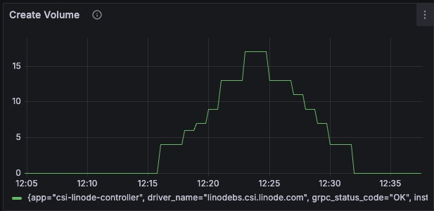
  - **Explanation**: This graph shows the rate of volume creation requests over time.

- **Total Time Taken to Create Volume**
  - **Description**: Displays the cumulative time taken to create volumes.
  - **Query**: `csi_sidecar_operations_seconds_sum{method_name="/csi.v1.Controller/CreateVolume"}`
  - **X-axis**: The time intervals during which the create requests were processed.
  - **Y-axis**: The time taken for each request (in seconds).
  - **Graph**:  
    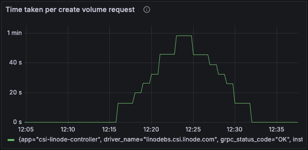

---

#### **Controller Delete Volume**

- **Delete Volume Requests**
  - **Description**: Shows the number of requests to delete volumes through the CSI Driver.
  - **Query**: `csi_sidecar_operations_seconds_count{method_name="/csi.v1.Controller/DeleteVolume"}`
  - **X-axis**: Time intervals during which requests were made.
  - **Y-axis**: Number of delete requests over time.
  - **Graph**:  
    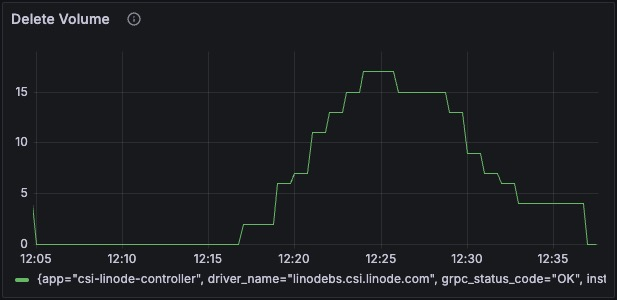

- **Total Time Taken to Delete Volume**
  - **Description**: Tracks the time spent deleting volumes.
  - **Query**: `csi_sidecar_operations_seconds_sum{method_name="/csi.v1.Controller/DeleteVolume"}`
  - **X-axis**: Time intervals when delete requests were made.
  - **Y-axis**: Time taken per request (in seconds).
  - **Graph**:  
    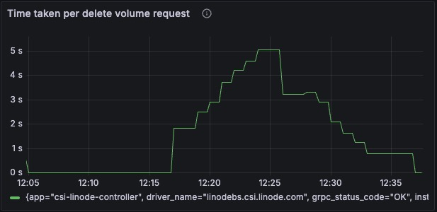

---

#### **Controller Expand Volume**

- **Expand Volume Requests**
  - **Description**: Monitors requests to expand volumes.
  - **Query**: `csi_sidecar_operations_seconds_count{method_name="/csi.v1.Controller/ControllerExpandVolume"}`
  - **X-axis**: Time intervals of requests.
  - **Y-axis**: Number of expansion requests.
  - **Graph**:  
    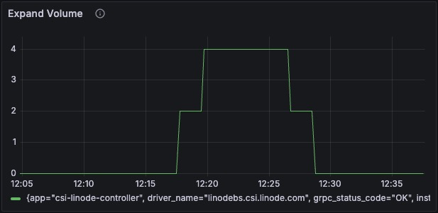

- **Total Time Taken to Expand Volume**
  - **Description**: Displays the cumulative time taken to expand volumes.
  - **Query**: `csi_sidecar_operations_seconds_sum{method_name="/csi.v1.Controller/ControllerExpandVolume"}`
  - **X-axis**: The timeline of expand requests.
  - **Y-axis**: Time taken per request (in seconds).
  - **Graph**:  
    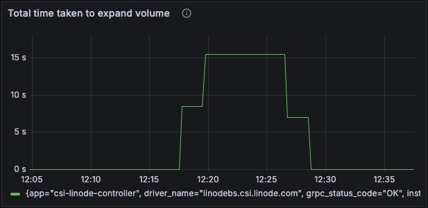

---

#### **Controller Publish Volume**

- **Publish Volume Requests**
  - **Description**: The number of requests made to attach or publish volumes to nodes.
  - **Query**: `csi_sidecar_operations_seconds_count{method_name="/csi.v1.Controller/ControllerPublishVolume"}`
  - **X-axis**: Time intervals of publish requests.
  - **Y-axis**: Number of publish requests made over time.
  - **Graph**:  
    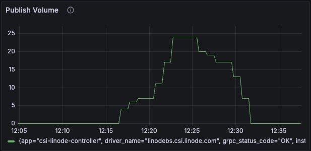

- **Total Time Taken to Publish Volume**
  - **Description**: Displays the cumulative time taken to publish (attach) volumes to nodes.
  - **Query**: `csi_sidecar_operations_seconds_sum{method_name="/csi.v1.Controller/ControllerPublishVolume"}`
  - **X-axis**: Time intervals of publish requests.
  - **Y-axis**: Time taken per request (in minutes).
  - **Graph**:  
    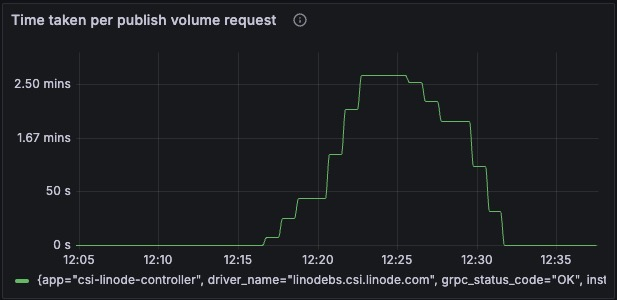

---

#### **Controller Unpublish Volume**

- **Unpublish Volume Requests**
  - **Description**: Tracks the number of requests to unpublish volumes.
  - **Query**: `csi_sidecar_operations_seconds_count{method_name="/csi.v1.Controller/ControllerUnpublishVolume"}`
  - **X-axis**: : Time intervals of unpublish requests.
  - **Y-axis**: Number of unpublish requests.
  - **Graph**:  
    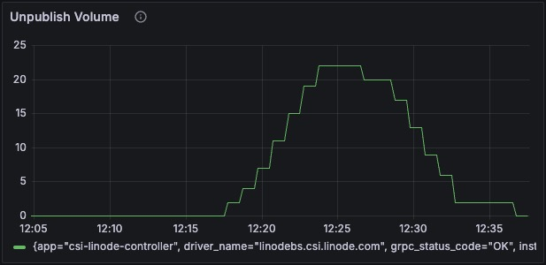
  - **Explanation**: This graph shows how frequently volumes are unpublished (detached) from nodes.

- **Total Time Taken to Unpublish Volume**
  - **Description**: Displays the cumulative time taken to unpublish (detach) volumes from nodes.
  - **Query**: `csi_sidecar_operations_seconds_sum{method_name="/csi.v1.Controller/ControllerUnpublishVolume"}`
  - **X-axis**: The time intervals of unpublish requests.
  - **Y-axis**: Time taken per request (in minutes).
  - **Graph**:  
    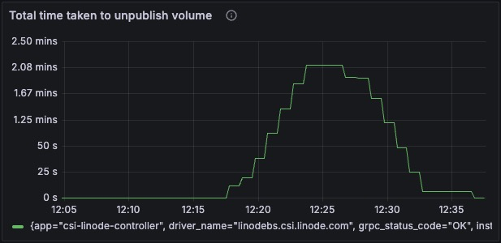

---

### 4. **Additional Metrics**

---

#### **Persistent Volumes (PV)**

- **Description**: Displays the total number of PV-related events that the CSI controller processed.
- **Query**: `workqueue_adds_total{name="volumes"}`
- **X-axis**: Time interval for requests.
- **Y-axis**: Number of PVRs made over time.
- **Graph**:  
  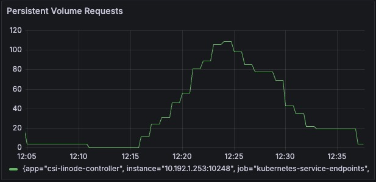
---

#### **Volume Claims (PVC)**

- **Description**: Tracks the number of PVC-related events that the controller reconciles.
- **Query**: `workqueue_adds_total{name="claims"}`
- **X-axis**: Time interval for PVC claims.
- **Y-axis**: Number of PVC's made over time
- **Graph**:  
  

---

#### **Runtime Operation Errors**

- **Description**: Visualizes errors encountered by the CSI Driver during operations.
- **Query**: `kubelet_runtime_operations_errors_total`
- **X-axis**: Time interval of operations
- **Y-axis**: Number of errors
- **Graph**:  
  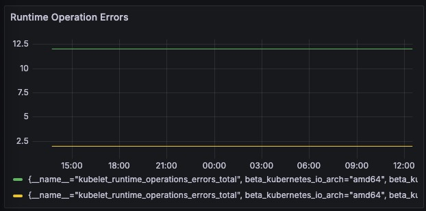

---

#### **CSI Sidecar Operations Seconds Sum**

- **Description**: Shows the cumulative time taken for operations handled by CSI sidecars (attacher, provisioner, etc.).
- **Query**: `csi_sidecar_operations_seconds_sum`
- **X-axis**: Time interval of operations
- **Y-axis**: Max time taken for each operation
- **Graph**:  
  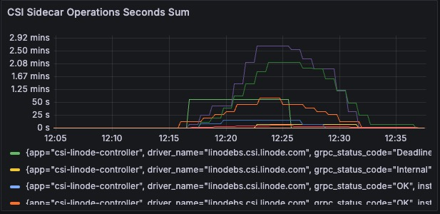

---

### 5. **Node Server Metrics**

---

#### **Expand volume**

- **Description**: Shows the time taken for expand volume operation
- **Query**: `csi_node_expand_duration_seconds_count{functionStatus="true"}`
- **X-axis**: Time intervals when the operations occurred.
- **Y-axis**: The time taken for each expand operation (measured in milliseconds and seconds).
- **Graph**:
  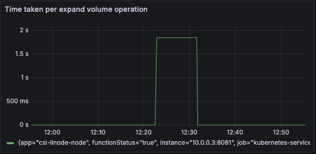

---

#### **Stage volume**

- **Description**: Shows the time taken for stage volume operation
- **Query**: `csi_node_stage_duration_seconds_count{functionStatus="true"}`
- **X-axis**: Timeline of the publish operations.
- **Y-axis**: The actual time taken per publish request (in seconds).
- **Graph**:
  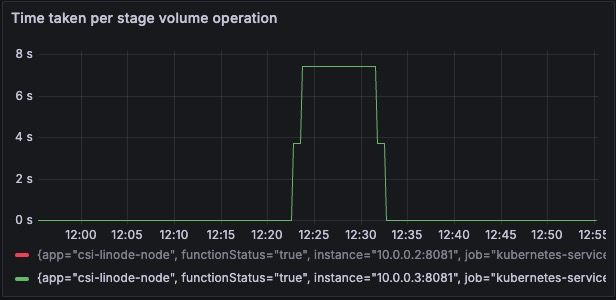

---

#### **Unstage volume**

- **Description**: Shows the time taken for unstage volume operation
- **Query**: `csi_node_unstage_duration_seconds_count{functionStatus="true"}`
- **X-axis**: The time when staging operations occurred.
- **Y-axis**: Time taken per operation (in seconds).
- **Graph**:
  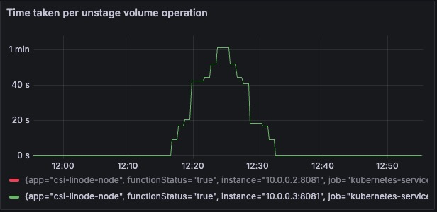

---

#### **Publish volume**

- **Description**: Shows the time taken for publish volume operation
- **Query**: `csi_node_publish_duration_seconds_count{functionStatus="true"}`
- **X-axis**: The timeline of unpublish requests.
- **Y-axis**: Time taken for each request (in seconds).
- **Graph**:
  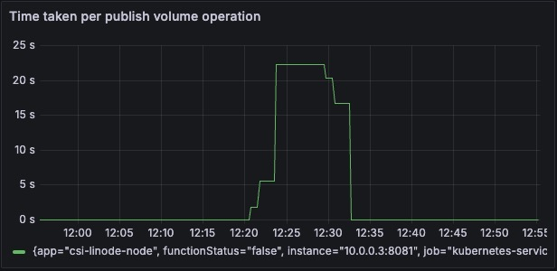

---

#### **Unpublish volume**

- **Description**: Shows the time taken for unpublish volume operation
- **Query**: `csi_node_unpublish_duration_seconds_count{functionStatus="true"}`
- **X-axis**: The timeline of unstaging requests.
- **Y-axis**: Time taken for each operation (in seconds).
- **Graph**:
  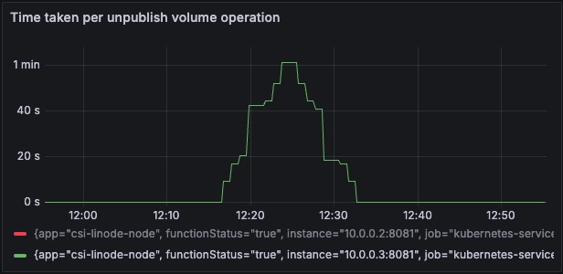

---

### 6. **Controller Server Metrics**

---

#### **Create Volume**

- **Description**: This graph tracks the time taken for each "Create Volume" request made by the CSI driver on a Kubernetes node.
- **Query**: `csi_controller_create_volume_duration_seconds_count{functionStatus="true"}`
- **X-axis**: The X-axis represents the time in minutes. Each tick represents the interval between two consecutive points where a request was made.
- **Y-axis**: The Y-axis shows the time taken for each operation in seconds or minutes.
- **Graph**:
  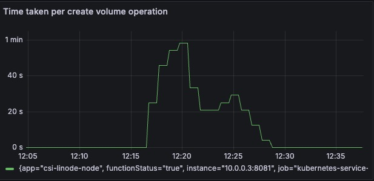

---

#### **Delete Volume**

- **Description**: This graph tracks the time taken for "Delete Volume" operations.
- **Query**: `csi_controller_delete_volume_duration_seconds_count{functionStatus="true"}`
- **X-axis**: Represents the timeline for when the delete operations were executed.
- **Y-axis**: Shows the time taken for the delete operations in seconds.
- **Graph**:
  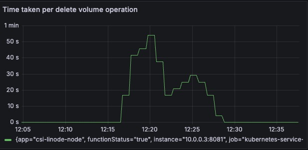

---

#### **Publish Volume**

- **Description**: This graph records the time taken to publish (attach) a volume to a node within the Kubernetes cluster.
- **Query**: `csi_controller_publish_volume_duration_seconds_count{functionStatus="true"}`
- **X-axis**: Represents time intervals when the publish operations occurred.
- **Y-axis**: Displays the time taken for each publish operation.
- **Graph**:
  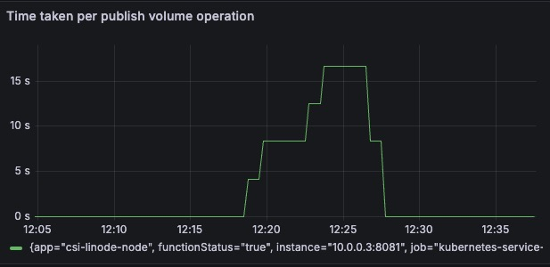

---

#### **Unpublish Volume**

- **Description**: This graph shows the time taken for each "Unpublish Volume" operation, where a volume is detached from the node.
- **Query**: `csi_controller_unpublish_volume_duration_seconds_count{functionStatus="true"}`
- **X-axis**: Timeline of the unpublish operations.
- **Y-axis**: Time taken for each unpublish operation.
- **Graph**:
  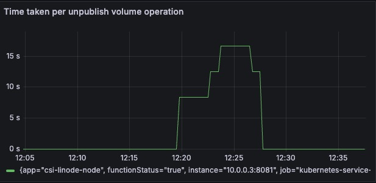 