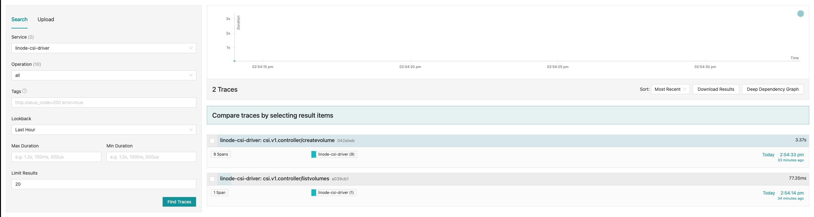
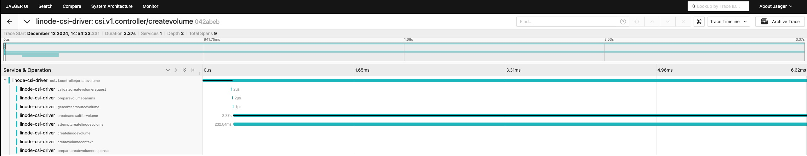
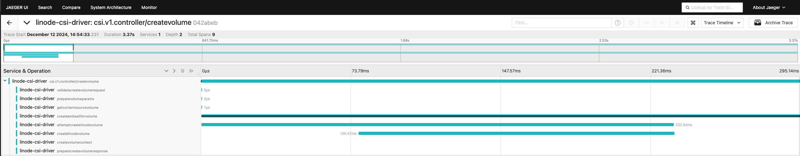

# Using the Jaeger Dashboard for Linode CSI Driver

This guide provides a step-by-step explanation of how to use the Jaeger dashboard to analyze traces in the Linode CSI Driver. It includes visual examples for both the **landing page** and an example trace for the `createvolume` operation.

---

## 1. Accessing the Jaeger Dashboard

To access the Jaeger dashboard:
1. Open the Jaeger dashboard in your browser using the external IP (e.g., `http://<external-ip>:16686`).
2. The landing page will appear, providing options to search and analyze traces.

---

## 2. Landing Page Overview

The landing page is the first screen you see upon accessing the Jaeger dashboard. Here's an example:

**Example Landing Page Screenshot**:  


### Key Features of the Landing Page:
- **Search Panel**:
    - **Service**: Select the service you want to analyze (e.g., `linode-csi-driver`).
    - **Operation**: Choose a specific operation to filter traces, such as `createvolume` or `listvolumes`. By default, all operations are shown.
    - **Tags**: Filter traces by tags like `http.status_code=200` or other metadata.
    - **Lookback**: Select a time range for trace results (e.g., "Last Hour").
    - **Max/Min Duration**: Specify duration filters for traces to focus on slow or fast requests.
    - **Limit Results**: Set the maximum number of traces to display.

- **Results Table**:
    - Lists all traces matching the search criteria.
    - Displays the following information:
        - **Service and Operation**: The service (e.g., `linode-csi-driver`) and the operation (e.g., `createvolume` or `listvolumes`).
        - **Duration**: Total time taken by the trace.
        - **Spans**: Number of sub-operations (spans) in the trace.
        - **Timestamp**: The time the trace started.

### Example Analysis:
From the landing page example:
- Two traces are displayed:
    1. **Trace ID: 042abeb**:
        - **Operation**: `csi.v1.controller/createvolume`.
        - **Duration**: `3.37s`.
        - **Spans**: `9`.
    2. **Trace ID: a039cb1**:
        - **Operation**: `csi.v1.controller/listvolumes`.
        - **Duration**: `77.35ms`.
        - **Spans**: `1`.

To analyze a trace in detail, click on its row (e.g., `042abeb` for `createvolume`).

---

## 3. Viewing a Trace for `createvolume`

Clicking on a trace opens a detailed view of all operations (spans) involved in the request. Here's an example trace for `createvolume`:

**Example `createvolume` Trace Screenshot**:  



### Trace View Key Features:
1. **Trace Timeline**:
    - Visualizes the entire flow of the request as a timeline.
    - Horizontal bars represent spans, showing the relative time and duration of each operation.
    - The black line represents the critical path of the selected operation.
    - Total trace duration is displayed at the top (e.g., `3.37s`).

2. **Service & Operation Breakdown**:
    - Displays a hierarchical list of operations executed during the trace.
    - **Parent Span**: Represents the top-level operation (e.g., `csi.v1.controller/createvolume`).
    - **Child Spans**: Nested operations under the parent span.

### Example Breakdown:
For the `createvolume` trace:
- **Parent Span**:
    - **Operation**: `csi.v1.controller/createvolume`.
    - **Duration**: `3.37s`.
    - Includes the following sub-operations:
        1. **`validatecreatevolumerequest`**:
            - **Duration**: `2µs`.
            - **Purpose**: Validates the incoming request for required parameters.
        2. **`preparevolumeparams`**:
            - **Duration**: `2µs`.
            - **Purpose**: Prepares necessary parameters for volume creation.
        3. **`getcontentsourcevolume`**:
            - **Duration**: `1µs`.
            - **Purpose**: Retrieves existing content sources (if applicable).
        4. **`createandwaitforvolume`**:
            - **Duration**: `3.37s`.
            - **Purpose**: Creates the volume in Linode and waits for the operation to complete.
            - Sub-operations include:
                - **`attemptcreatelinodevolume`**:
                    - **Duration**: `232.64ms`.
                    - **Purpose**: It checks for existing volumes with the same label and either returns the existing volume or creates a new one, optionally cloning from a source volume.
                - **`createLinodeVolume`**:
                  - **Duration**: `155.47ms`.
                  - **Purpose**: creates a new Linode volume with the specified label, size, and tags. It returns the created volume or an error if the creation fails.
        5. **`createvolumecontext`**:
            - Prepares the context for the created volume and adds necessary attributes.
            - - **Duration**: `4µs`.
        6. **`preparecreatevolumeresponse`**:
            - **Duration**: `4µs`.
            - **Purpose**: Prepares the response to return to the caller.

---

# Updating spans to provide additional information

If you want to track additional information in a span, you can utilize the functions `TraceFunctionData` and `SerializeObject` in `pkg/observability/tracker.go` to your advantage.

## 1. `TraceFunctionData`: Tracing Function Calls

The `TraceFunctionData` function simplifies the process of tracing the behavior of your functions. It captures key information about function execution, including parameters, success or error status, and error details (if any).

### **Function Signature**

```go
func TraceFunctionData(span tracer.Span, operationName string, params map[string]string, err error) error
```

### **Key Features**
- **Span Attributes**:
    - Adds key-value pairs from the `params` map as attributes to the span for better trace details.
- **Success or Error Handling**:
    - Sets the span status to `codes.Ok` for successful execution or `codes.Error` for failures.
    - Logs the result (`success` or `error`) along with the `operationName` and `params`.
- **Error Recording**:
    - Captures error details in the span using `span.RecordError`.

### **Example Usage**

You can use `TraceFunctionData` in any function to add tracing with custom parameters:

```go
observability.TraceFunctionData(span, "ValidateCreateVolumeRequest", map[string]string{
    "volume_name": req.GetName(),
    "requestBody": observability.SerializeObject(req)}, err)
```

Here:
- `span`: The current tracing span.
- `"ValidateCreateVolumeRequest"`: The name of the operation being traced.
- `map[string]string`: A map of custom parameters to include in the trace. Add any details you want to capture, like volume names, request IDs, or serialized objects returned by API calls.
- `err`: The error object (if any) from the function being traced.

---

## 2. `SerializeObject`: Serializing Objects for Tracing

The `SerializeObject` function converts complex objects into JSON strings, making it easier to include them in trace parameters or logs.

### **Function Signature**

```go
func SerializeObject(obj interface{}) string
```

### **Key Features**
- Converts any object (`struct`, `map`, etc.) into a JSON string.
- Handles serialization errors gracefully and logs the issue.
- Useful for including large or complex objects in the trace parameters.

### **Example Usage**

You can serialize objects like a request body and append them to the `params` map:

```go
observability.TraceFunctionData(span, "CreateVolume", map[string]string{
    "requestBody": observability.SerializeObject(req),
    "volume_type": "block-storage",
}, nil)
```
Here:
- The request object `req` is serialized into a JSON string using `SerializeObject`.
- The serialized string is added to the `params` map as `"requestBody"`.

--- 

## 3. Adding tracing to a function

To integrate `TraceFunctionData` and `SerializeObject` into your function:

1. Create a Span:
    - Use the `StartFunctionSpan` function from tracker.go to create a span at the beginning of your function
2. Capture Parameters:
   - Use a `map[string] string` to include parameters you want to capture.
   - Serialize objects using `SerializeObject` if needed.
3. Call `TraceFunctionData`:
   - Pass the span, operation name, parameters, and any error to `TraceFunctionData` wherever necessary.

### **Example**

```go
func CreateVolumeRequest(ctx context.Context, req *csi.CreateVolumeRequest) error {
    // Step 1: Create a Span
    _, span := observability.StartFunctionSpan(ctx)
    defer span.End() // Ensure the span ends when the function exits

    // Step 2: Capture Parameters
    // Initialize a map to hold custom trace parameters
    params := map[string]string{
        "volume_name": req.GetName(),
        "capacity_range": observability.SerializeObject(req.GetCapacityRange()),
        "parameters": observability.SerializeObject(req.GetParameters()),
    }

    // Simulate parameter validation
    if req.GetName() == "" {
        err := fmt.Errorf("volume name is missing")
        
        // Step 3: Call TraceFunctionData with error
        observability.TraceFunctionData(span, "ValidateCreateVolumeRequest", params, err)
        return err
    }
	
    // On success
    // Step 3: Call TraceFunctionData with no error
    observability.TraceFunctionData(span, "CreateVolumeRequest", params, nil)
    return nil
}
```

---

## Benefits of Using This Approach

- **Detailed Traces**:
    - Include all relevant details about function execution, making it easier to debug issues.
- **Error Visibility**:
    - Automatically records errors and logs them with context.
- **Flexibility**:
    - Add or modify parameters dynamically based on your function's needs.
- **Serialization**:
    - Handles complex objects seamlessly without additional manual string conversion.
---
